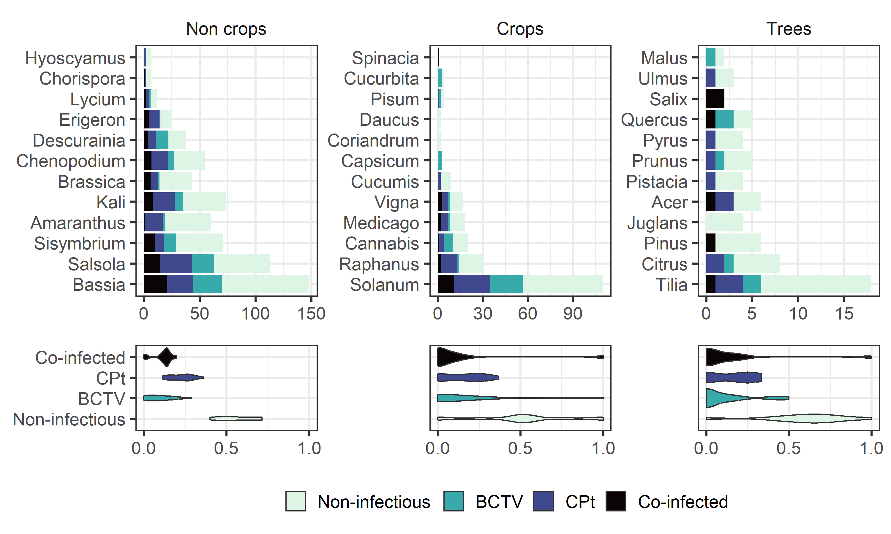
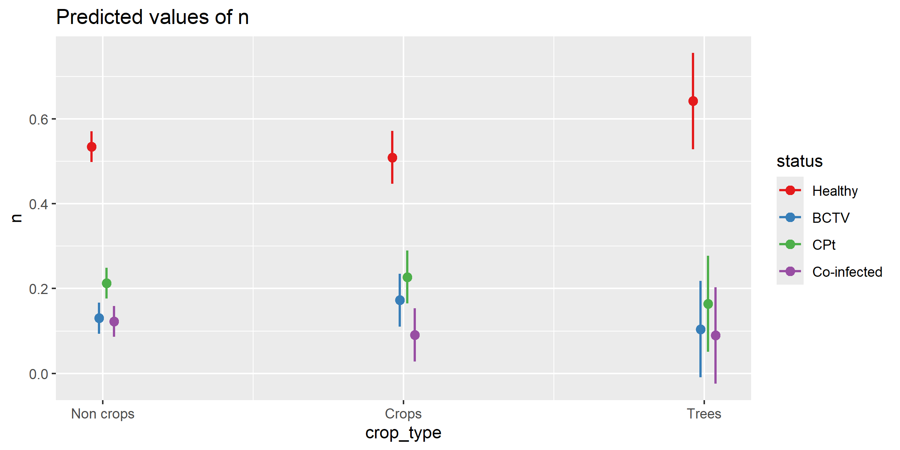
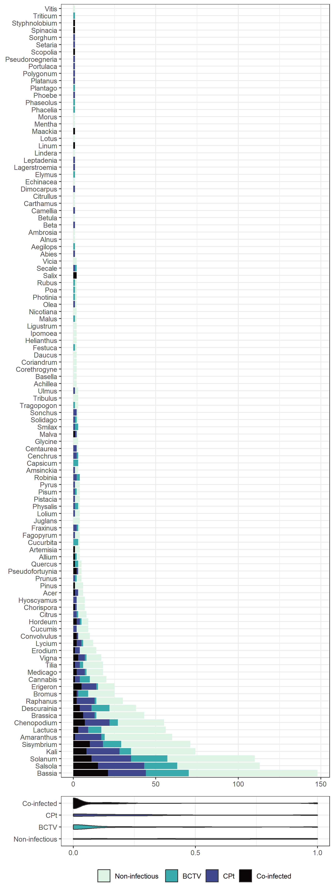
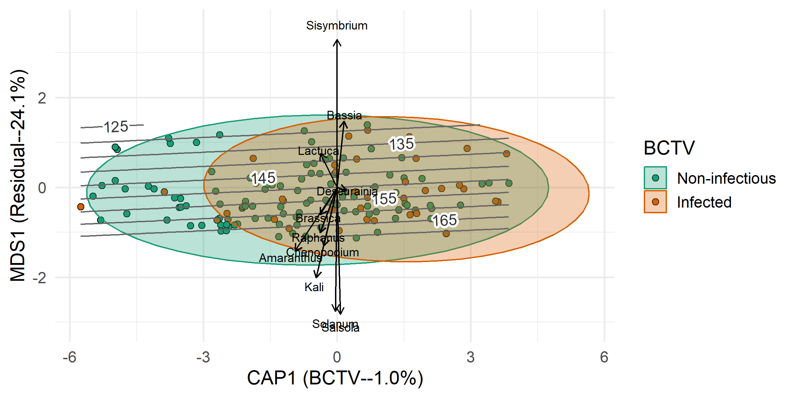
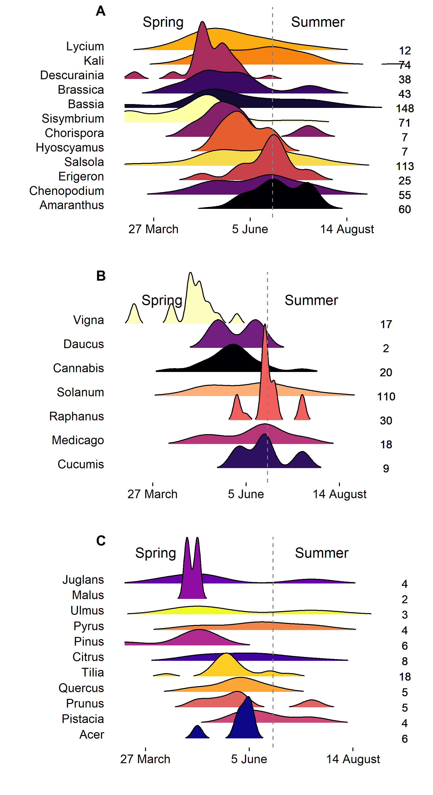

BLH Gut Diversity in Potato
================
Riley M. Anderson
January 14, 2026

  

- [Summary stats:](#summary-stats)
  - [Infections by host plant (plant that BLH was collected
    from)](#infections-by-host-plant-plant-that-blh-was-collected-from)
  - [Table of plants found in guts and their proportions and
    counts:](#table-of-plants-found-in-guts-and-their-proportions-and-counts)
- [Figure 2](#figure-2)
  - [Figure 2 stats:](#figure-2-stats)
  - [Supplemental Figure 1](#supplemental-figure-1)
- [Figure 3](#figure-3)
  - [PERMANOVA](#permanova)
  - [CAP with Isoclines:](#cap-with-isoclines)
- [Figure 4](#figure-4)
  - [Session Information](#session-information)

## Summary stats:

### Infections by host plant (plant that BLH was collected from)

| Host plant      | Total | BCTV | CPt | Healthy | Co-infected |
|:----------------|------:|-----:|----:|--------:|------------:|
| Filaree         |     1 |    0 |   1 |       0 |           0 |
| Flixweed        |    24 |   12 |   5 |      10 |           3 |
| Kochia          |    67 |   15 |  18 |      38 |           4 |
| Lambsquarter    |     1 |    0 |   1 |       0 |           0 |
| Mustard         |     3 |    1 |   1 |       2 |           1 |
| Pigweed         |    11 |    0 |   2 |       9 |           0 |
| Potato          |    16 |    8 |   1 |       8 |           1 |
| Russian thistle |    64 |   20 |  34 |      24 |          14 |
| Tumble mustard  |    40 |   14 |   9 |      23 |           6 |

### Table of plants found in guts and their proportions and counts:

``` r

plant_table <- dat1 %>% select(family, genus) %>% 
  group_by(family, genus) %>% 
  tally(name = "detections") %>% 
  mutate(percent = round(detections / nrow(dat1), 4) * 100) %>% 
  arrange(desc(percent))

kable(plant_table,
      format = "markdown",
      digits = 2)
```

| family         | genus           | detections | percent |
|:---------------|:----------------|-----------:|--------:|
| Solanaceae     | Solanum         |        232 |   17.83 |
| Amaranthaceae  | Bassia          |        148 |   11.38 |
| Amaranthaceae  | Salsola         |        113 |    8.69 |
| Amaranthaceae  | Kali            |         74 |    5.69 |
| Brassicaceae   | Sisymbrium      |         71 |    5.46 |
| Amaranthaceae  | Amaranthus      |         60 |    4.61 |
| Asteraceae     | Lactuca         |         56 |    4.30 |
| Amaranthaceae  | Chenopodium     |         55 |    4.23 |
| Brassicaceae   | Brassica        |         43 |    3.31 |
| Brassicaceae   | Descurainia     |         38 |    2.92 |
| Brassicaceae   | Raphanus        |         30 |    2.31 |
| Asteraceae     | Erigeron        |         25 |    1.92 |
| Poaceae        | Bromus          |         25 |    1.92 |
| Cannabaceae    | Cannabis        |         20 |    1.54 |
| Fabaceae       | Medicago        |         18 |    1.38 |
| Malvaceae      | Tilia           |         18 |    1.38 |
| Fabaceae       | Vigna           |         17 |    1.31 |
| Geraniaceae    | Erodium         |         14 |    1.08 |
| Solanaceae     | Lycium          |         12 |    0.92 |
| Convolvulaceae | Convolvulus     |         10 |    0.77 |
| Cucurbitaceae  | Cucumis         |          9 |    0.69 |
| Poaceae        | Hordeum         |          9 |    0.69 |
| Rutaceae       | Citrus          |          8 |    0.61 |
| Brassicaceae   | Chorispora      |          7 |    0.54 |
| Solanaceae     | Hyoscyamus      |          7 |    0.54 |
| Pinaceae       | Pinus           |          6 |    0.46 |
| Sapindaceae    | Acer            |          6 |    0.46 |
| Brassicaceae   | Pseudofortuynia |          5 |    0.38 |
| Fagaceae       | Quercus         |          5 |    0.38 |
| Rosaceae       | Prunus          |          5 |    0.38 |
| Amaryllidaceae | Allium          |          4 |    0.31 |
| Anacardiaceae  | Pistacia        |          4 |    0.31 |
| Asteraceae     | Artemisia       |          4 |    0.31 |
| Cucurbitaceae  | Cucurbita       |          4 |    0.31 |
| Fabaceae       | Pisum           |          4 |    0.31 |
| Fabaceae       | Robinia         |          4 |    0.31 |
| Juglandaceae   | Juglans         |          4 |    0.31 |
| Oleaceae       | Fraxinus        |          4 |    0.31 |
| Poaceae        | Lolium          |          4 |    0.31 |
| Polygonaceae   | Fagopyrum       |          4 |    0.31 |
| Rosaceae       | Pyrus           |          4 |    0.31 |
| Solanaceae     | Physalis        |          4 |    0.31 |
| Asteraceae     | Centaurea       |          3 |    0.23 |
| Asteraceae     | Solidago        |          3 |    0.23 |
| Asteraceae     | Sonchus         |          3 |    0.23 |
| Asteraceae     | Tragopogon      |          3 |    0.23 |
| Boraginaceae   | Amsinckia       |          3 |    0.23 |
| Fabaceae       | Glycine         |          3 |    0.23 |
| Malvaceae      | Malva           |          3 |    0.23 |
| Poaceae        | Cenchrus        |          3 |    0.23 |
| Smilacaceae    | Smilax          |          3 |    0.23 |
| Solanaceae     | Capsicum        |          3 |    0.23 |
| Ulmaceae       | Ulmus           |          3 |    0.23 |
| Zygophyllaceae | Tribulus        |          3 |    0.23 |
| Apiaceae       | Coriandrum      |          2 |    0.15 |
| Apiaceae       | Daucus          |          2 |    0.15 |
| Asteraceae     | Achillea        |          2 |    0.15 |
| Asteraceae     | Corethrogyne    |          2 |    0.15 |
| Asteraceae     | Helianthus      |          2 |    0.15 |
| Basellaceae    | Basella         |          2 |    0.15 |
| Convolvulaceae | Ipomoea         |          2 |    0.15 |
| Fabaceae       | Vicia           |          2 |    0.15 |
| Oleaceae       | Ligustrum       |          2 |    0.15 |
| Oleaceae       | Olea            |          2 |    0.15 |
| Poaceae        | Festuca         |          2 |    0.15 |
| Poaceae        | Poa             |          2 |    0.15 |
| Poaceae        | Secale          |          2 |    0.15 |
| Rosaceae       | Malus           |          2 |    0.15 |
| Rosaceae       | Photinia        |          2 |    0.15 |
| Rosaceae       | Rubus           |          2 |    0.15 |
| Salicaceae     | Salix           |          2 |    0.15 |
| Solanaceae     | Nicotiana       |          2 |    0.15 |
| Amaranthaceae  | Beta            |          1 |    0.08 |
| Amaranthaceae  | Spinacia        |          1 |    0.08 |
| Apocynaceae    | Leptadenia      |          1 |    0.08 |
| Asteraceae     | Ambrosia        |          1 |    0.08 |
| Asteraceae     | Carthamus       |          1 |    0.08 |
| Asteraceae     | Echinacea       |          1 |    0.08 |
| Betulaceae     | Alnus           |          1 |    0.08 |
| Betulaceae     | Betula          |          1 |    0.08 |
| Boraginaceae   | Phacelia        |          1 |    0.08 |
| Cucurbitaceae  | Citrullus       |          1 |    0.08 |
| Fabaceae       | Lotus           |          1 |    0.08 |
| Fabaceae       | Maackia         |          1 |    0.08 |
| Fabaceae       | Phaseolus       |          1 |    0.08 |
| Fabaceae       | Styphnolobium   |          1 |    0.08 |
| Lamiaceae      | Mentha          |          1 |    0.08 |
| Lauraceae      | Lindera         |          1 |    0.08 |
| Lauraceae      | Phoebe          |          1 |    0.08 |
| Linaceae       | Linum           |          1 |    0.08 |
| Lythraceae     | Lagerstroemia   |          1 |    0.08 |
| Morceae        | Morus           |          1 |    0.08 |
| Pinaceae       | Abies           |          1 |    0.08 |
| Plantaginaceae | Plantago        |          1 |    0.08 |
| Platanaceae    | Platanus        |          1 |    0.08 |
| Poaceae        | Aegilops        |          1 |    0.08 |
| Poaceae        | Elymus          |          1 |    0.08 |
| Poaceae        | Pseudoroegneria |          1 |    0.08 |
| Poaceae        | Setaria         |          1 |    0.08 |
| Poaceae        | Sorghum         |          1 |    0.08 |
| Poaceae        | Triticum        |          1 |    0.08 |
| Polygonaceae   | Polygonum       |          1 |    0.08 |
| Portulacaceae  | Portulaca       |          1 |    0.08 |
| Sapindaceae    | Dimocarpus      |          1 |    0.08 |
| Solanaceae     | Scopolia        |          1 |    0.08 |
| Theaceae       | Camellia        |          1 |    0.08 |
| Vitaceae       | Vitis           |          1 |    0.08 |

``` r

# number of families found:
dat1 %>% 
  select(family) %>% distinct() %>% nrow()
## [1] 40
```

``` r

# number of genera found:
dat1 %>% 
  select(genus) %>% distinct() %>% nrow()
## [1] 107
```

``` r

# number of tested BLH:
dat1 %>% uncount(blh_mix_count) %>% select(BLH_ID) %>% 
  distinct() %>% nrow()
## [1] 226
```

``` r

# infection status of positive S. citri BLH:
dat1 %>% uncount(blh_mix_count) %>% 
  filter(!is.na(S_citri)) %>% 
  filter(S_citri == 1) %>% 
  select(BLH_ID, BCTV, CPt, S_citri, Year) %>% distinct()
##   BLH_ID BCTV CPt S_citri Year
## 1    P50    0   0       1 2019
## 2    P82    0   0       1 2020
## 3    P95    0   0       1 2020
## 4   P104    0   0       1 2020
## 5   P119    1   1       1 2020
## 6   P122    0   1       1 2020
## 7   P141    1   0       1 2020
## 8   P146    0   0       1 2020
## 9   P151    0   0       1 2020
```

``` r

# number of non-infectious:
dat1 %>% uncount(blh_mix_count) %>% 
  select(BLH_ID, BCTV, CPt, S_citri) %>% distinct() %>% 
  mutate(S_citri = case_when(
    S_citri == 1 ~ 1,
    TRUE ~ 0
  )) %>% 
  filter(BCTV != 1 & CPt != 1 & S_citri != 1) %>% nrow()
## [1] 108
```

``` r

# number of BCTV only:
dat1 %>% uncount(blh_mix_count) %>% 
  select(BLH_ID, BCTV, CPt, S_citri) %>% distinct() %>% 
  mutate(S_citri = case_when(
    S_citri == 1 ~ 1,
    TRUE ~ 0
  )) %>% 
  filter(BCTV == 1 & CPt != 1 & S_citri != 1) %>% nrow()
## [1] 39
```

``` r

# number of CPt only:
dat1 %>% uncount(blh_mix_count) %>% 
  select(BLH_ID, BCTV, CPt, S_citri) %>% distinct() %>% 
  mutate(S_citri = case_when(
    S_citri == 1 ~ 1,
    TRUE ~ 0
  )) %>% 
  filter(BCTV != 1 & CPt == 1 & S_citri != 1) %>% nrow()
## [1] 42
```

``` r

# number of BCTV & CPt:
dat1 %>% uncount(blh_mix_count) %>% 
  select(BLH_ID, BCTV, CPt, S_citri) %>% distinct() %>% 
  mutate(S_citri = case_when(
    S_citri == 1 ~ 1,
    TRUE ~ 0
  )) %>% 
  filter(BCTV == 1 & CPt == 1) %>% nrow()
## [1] 29
```

``` r

# number of N. tenellus collected in 2020:
dat1 %>% uncount(blh_mix_count) %>% 
  select(BLH_ID, Year) %>% 
  distinct() %>% 
  filter(Year == "2020") %>% nrow()
## [1] 92
```

``` r


# percents of crop type (anything not in the crop_type.csv is considered a weed)
dat1 %>% uncount(blh_mix_count) %>% 
  left_join(., crop_type, by = "genus") %>% 
  mutate(crop_type = factor(case_when(
    is.na(crop_type) ~ "non crop",
    TRUE ~ crop_type
  ))) %>% 
  group_by(crop_type) %>% 
  tally() %>% 
  mutate(prop = round(n / sum(n), 4) * 100)
## # A tibble: 3 × 3
##   crop_type     n  prop
##   <fct>     <int> <dbl>
## 1 crop        343 26.3 
## 2 non crop    893 68.5 
## 3 tree         67  5.14
```

# Figure 2

<!-- -->

## Figure 2 stats:

    ## Analysis of Variance Table
    ## 
    ## Response: n
    ##                   Df  Sum Sq Mean Sq  F value Pr(>F)    
    ## status             3 107.715  35.905 163.3123 <2e-16 ***
    ## crop_type          2   0.000   0.000   0.0000 1.0000    
    ## status:crop_type   6   1.699   0.283   1.2879 0.2671    
    ## Residuals        132  29.021   0.220                    
    ## ---
    ## Signif. codes:  0 '***' 0.001 '**' 0.01 '*' 0.05 '.' 0.1 ' ' 1
    ## 
    ## Call:
    ## lm(formula = n ~ status * crop_type, data = inf_stat_data, weights = total)
    ## 
    ## Weighted Residuals:
    ##     Min      1Q  Median      3Q     Max 
    ## -0.9777 -0.2559 -0.0944  0.2148  1.4329 
    ## 
    ## Coefficients:
    ##                                   Estimate Std. Error t value Pr(>|t|)    
    ## (Intercept)                       0.534456   0.018349  29.127   <2e-16 ***
    ## statusBCTV                       -0.404288   0.025949 -15.580   <2e-16 ***
    ## statusCPt                        -0.321593   0.025949 -12.393   <2e-16 ***
    ## statusCo-infected                -0.411945   0.025949 -15.875   <2e-16 ***
    ## crop_typeCrops                   -0.025365   0.036552  -0.694   0.4889    
    ## crop_typeTrees                    0.107335   0.060151   1.784   0.0767 .  
    ## statusBCTV:crop_typeCrops         0.067924   0.051692   1.314   0.1911    
    ## statusCPt:crop_typeCrops          0.039774   0.051692   0.769   0.4430    
    ## statusCo-infected:crop_typeCrops -0.006237   0.051692  -0.121   0.9041    
    ## statusBCTV:crop_typeTrees        -0.133026   0.085066  -1.564   0.1203    
    ## statusCPt:crop_typeTrees         -0.156019   0.085066  -1.834   0.0689 .  
    ## statusCo-infected:crop_typeTrees -0.140294   0.085066  -1.649   0.1015    
    ## ---
    ## Signif. codes:  0 '***' 0.001 '**' 0.01 '*' 0.05 '.' 0.1 ' ' 1
    ## 
    ## Residual standard error: 0.4689 on 132 degrees of freedom
    ## Multiple R-squared:  0.7904, Adjusted R-squared:  0.7729 
    ## F-statistic: 45.24 on 11 and 132 DF,  p-value: < 2.2e-16

<!-- -->

## Supplemental Figure 1

<!-- -->

# Figure 3

## PERMANOVA

    ## Permutation test for adonis under reduced model
    ## Terms added sequentially (first to last)
    ## Blocks:  strata 
    ## Permutation: free
    ## Number of permutations: 999
    ## 
    ## adonis2(formula = gut_mat_species ~ splines::ns(sample_date, df = 5) + BCTV * Year + CPt + region, data = gut_matrix, strata = gut_matrix$host_plant)
    ##                                   Df SumOfSqs      R2       F Pr(>F)    
    ## splines::ns(sample_date, df = 5)   5   10.062 0.16547 10.5879  0.001 ***
    ## BCTV                               1    0.727 0.01195  3.8232  0.005 ** 
    ## Year                               2    8.161 0.13421 21.4685  0.001 ***
    ## CPt                                1    0.306 0.00503  1.6078  0.267    
    ## region                             4    0.994 0.01635  1.3073  0.501    
    ## BCTV:Year                          2    0.644 0.01059  1.6945  0.181    
    ## Residual                         210   39.914 0.65640                   
    ## Total                            225   60.807 1.00000                   
    ## ---
    ## Signif. codes:  0 '***' 0.001 '**' 0.01 '*' 0.05 '.' 0.1 ' ' 1
    ## 
    ## Permutation test for homogeneity of multivariate dispersions
    ## Permutation: free
    ## Number of permutations: 999
    ## 
    ## Response: Distances
    ##            Df Sum Sq  Mean Sq      F N.Perm Pr(>F)  
    ## Groups      1 0.0661 0.066125 3.3202    999  0.075 .
    ## Residuals 224 4.4611 0.019916                       
    ## ---
    ## Signif. codes:  0 '***' 0.001 '**' 0.01 '*' 0.05 '.' 0.1 ' ' 1
    ## 
    ## Contrast: 0_1 
    ## 
    ##             average      sd   ratio     ava     avb cumsum     p  
    ## Bassia      0.10943 0.11305 0.96800 0.64330 0.69570  0.159 0.053 .
    ## Solanum     0.08911 0.10510 0.84780 0.49040 0.47830  0.288 0.188  
    ## Salsola     0.08733 0.10273 0.85020 0.49680 0.52170  0.415 0.013 *
    ## Sisymbrium  0.08160 0.11159 0.73130 0.31850 0.31880  0.533 0.226  
    ## Kali        0.06200 0.08149 0.76080 0.37580 0.21740  0.623 0.623  
    ## Lactuca     0.05493 0.08637 0.63600 0.28660 0.15940  0.703 0.799  
    ## Chenopodium 0.04844 0.08041 0.60240 0.27390 0.17390  0.773 0.665  
    ## Amaranthus  0.04835 0.09750 0.49590 0.36310 0.04350  0.843 0.991  
    ## Descurainia 0.04546 0.08196 0.55460 0.14650 0.21740  0.909 0.056 .
    ## Brassica    0.03972 0.07209 0.55090 0.22930 0.10140  0.966 0.926  
    ## Raphanus    0.02316 0.06001 0.38590 0.17200 0.04350  1.000 0.925  
    ## ---
    ## Signif. codes:  0 '***' 0.001 '**' 0.01 '*' 0.05 '.' 0.1 ' ' 1
    ## Permutation: free
    ## Number of permutations: 999

## CAP with Isoclines:

    ## 
    ## Call:
    ## capscale(formula = gut_mat_species ~ BCTV, data = gut_matrix,      distance = "bray") 
    ## 
    ## Partitioning of squared Bray distance:
    ##               Inertia Proportion
    ## Total         88.4979    1.00000
    ## Constrained    0.8823    0.00997
    ## Unconstrained 87.6156    0.99003
    ## 
    ## Eigenvalues, and their contribution to the squared Bray distance 
    ## 
    ## Importance of components:
    ##                          CAP1    MDS1    MDS2    MDS3   MDS4    MDS5    MDS6
    ## Eigenvalue            0.88234 19.8617 13.2831 12.2654 8.9563 7.10027 5.24598
    ## Proportion Explained  0.00997  0.2244  0.1501  0.1386 0.1012 0.08023 0.05928
    ## Cumulative Proportion 0.00997  0.2344  0.3845  0.5231 0.6243 0.70453 0.76381
    ##                          MDS7    MDS8   MDS9  MDS10  MDS11   MDS12    MDS13
    ## Eigenvalue            4.76270 4.12634 3.8231 2.6376 1.7081 1.04528 0.793717
    ## Proportion Explained  0.05382 0.04663 0.0432 0.0298 0.0193 0.01181 0.008969
    ## Cumulative Proportion 0.81762 0.86425 0.9074 0.9373 0.9566 0.96837 0.977335
    ##                          MDS14    MDS15    MDS16    MDS17    MDS18    MDS19
    ## Eigenvalue            0.562077 0.456406 0.308921 0.225590 0.195321 0.153833
    ## Proportion Explained  0.006351 0.005157 0.003491 0.002549 0.002207 0.001738
    ## Cumulative Proportion 0.983686 0.988843 0.992334 0.994883 0.997090 0.998828
    ##                           MDS20     MDS21
    ## Eigenvalue            0.0741044 0.0295878
    ## Proportion Explained  0.0008374 0.0003343
    ## Cumulative Proportion 0.9996657 1.0000000
    ## 
    ## Accumulated constrained eigenvalues
    ## Importance of components:
    ##                         CAP1
    ## Eigenvalue            0.8823
    ## Proportion Explained  1.0000
    ## Cumulative Proportion 1.0000

<!-- -->

# Figure 4

<!-- -->

## Session Information

    R version 4.2.3 (2023-03-15 ucrt)
    Platform: x86_64-w64-mingw32/x64 (64-bit)
    Running under: Windows 10 x64 (build 26200)

    Matrix products: default

    locale:
    [1] LC_COLLATE=English_United States.utf8 
    [2] LC_CTYPE=English_United States.utf8   
    [3] LC_MONETARY=English_United States.utf8
    [4] LC_NUMERIC=C                          
    [5] LC_TIME=English_United States.utf8    

    attached base packages:
    [1] stats     graphics  grDevices utils     datasets  methods   base     

    other attached packages:
     [1] gamm4_0.2-6     mgcv_1.8-42     nlme_3.1-162    lme4_1.1-35.3  
     [5] Matrix_1.5-3    ggrepel_0.9.5   ggExtra_0.10.1  knitr_1.47     
     [9] ggridges_0.5.6  sjPlot_2.8.16   vegan_2.6-6.1   lattice_0.20-45
    [13] permute_0.9-7   cowplot_1.1.3   lubridate_1.9.3 forcats_1.0.0  
    [17] stringr_1.5.1   dplyr_1.1.4     purrr_1.0.2     readr_2.1.5    
    [21] tidyr_1.3.1     tibble_3.2.1    ggplot2_3.5.1   tidyverse_2.0.0

    loaded via a namespace (and not attached):
     [1] insight_1.4.4      RColorBrewer_1.1-3 rprojroot_2.0.4    tools_4.2.3       
     [5] backports_1.5.0    utf8_1.2.4         R6_2.5.1           sjlabelled_1.2.0  
     [9] colorspace_2.1-0   withr_3.0.0        tidyselect_1.2.1   compiler_4.2.3    
    [13] performance_0.15.3 cli_3.6.2          isoband_0.2.7      labeling_0.4.3    
    [17] scales_1.3.0       checkmate_2.3.1    metR_0.17.0        digest_0.6.35     
    [21] minqa_1.2.7        rmarkdown_2.27     pkgconfig_2.0.3    htmltools_0.5.8.1 
    [25] fastmap_1.2.0      highr_0.11         rlang_1.1.4        rstudioapi_0.16.0 
    [29] shiny_1.8.1.1      generics_0.1.3     farver_2.1.2       magrittr_2.0.3    
    [33] Rcpp_1.0.12        munsell_0.5.1      fansi_1.0.6        lifecycle_1.0.4   
    [37] stringi_1.8.4      yaml_2.3.8         MASS_7.3-58.2      plyr_1.8.9        
    [41] grid_4.2.3         parallel_4.2.3     promises_1.3.0     sjmisc_2.8.10     
    [45] miniUI_0.1.1.1     ggeffects_1.6.0    haven_2.5.4        splines_4.2.3     
    [49] sjstats_0.19.0     hms_1.1.3          pillar_1.9.0       boot_1.3-28.1     
    [53] glue_1.7.0         evaluate_0.24.0    data.table_1.15.4  vctrs_0.6.5       
    [57] nloptr_2.0.3       tzdb_0.4.0         httpuv_1.6.15      gtable_0.3.5      
    [61] datawizard_1.3.0   cachem_1.1.0       xfun_0.44          mime_0.12         
    [65] xtable_1.8-4       later_1.3.2        viridisLite_0.4.2  memoise_2.0.1     
    [69] cluster_2.1.4      timechange_0.3.0  
